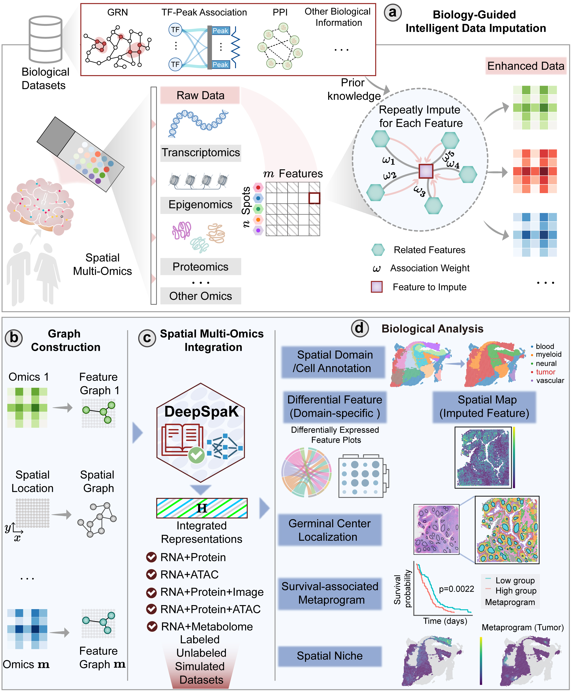

# Prior knowledge-enhanced deep learning enables comprehensive spatial multi-omics integration

# Installation & Dependencies
You'll need to install the following packages in order to run the codes.

| Package         | Version    |
|-----------------|------------|
| python          | 3.11.3     |
| pytorch         | 2.1.0      |
| cuda            | 12.1       |
| torchvision     | 0.16.0     |
| torchaudio      | 2.1.0      |
| torch-scatter   | 2.1.2      |
| torch-sparse    | 0.6.18     |
| torch_geometric | 2.5.2      |
| numpy           | 1.26.4     |
| pandas          | 2.2.3      |
| scanpy          | 1.9.3      |
| anndata         | 0.9.1      |
| scipy           | 1.14.1     |
| scikit-learn    | 1.7.0      |
| seaborn         | 0.13.2     |
| tqdm            | 4.66.5     |
| rpy2            | 3.4.1      |
| R               | 4.4.1      |
| mclust (R)      | 6.1.2      |

# Tutorial
For the step-by-step tutorial, please refer to:https://github.com/Bio-wust/DeepSpak/tree/main/tutorial

# Dataset

This project supports biology-guided imputation for three types of omics data. The data sources are as follows:

## RNA Imputation
- **Source**: [TRRUST](https://www.grtoolszen.com/trrust/) (Transcriptional Regulatory Relationships Unraveled by Sentence-based Text mining)
- **Usage**: Predict and impute expression values of low-expression genes using the Gene Regulatory Network (GRN)

## ADT (Protein) Imputation
- **Source**: [STRING](https://string-db.org/) (Search Tool for the Retrieval of Interacting Genes/Proteins)
- **Usage**: Predict and impute protein expression data using the Protein-Protein Interaction (PPI) network

## ATAC Imputation
- **Source**: [GENCODE](https://www.gencodegenes.org/) (Gene and Variation Annotation)
- **Usage**: Predict chromatin accessibility using Peak-TF (Transcription Factor binding site) mapping relationships based on TF expression levels

